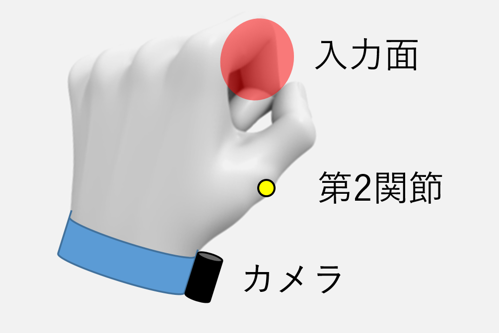

# はじめに{#sec:koko}

かいてみるああああああああああああああああああ
ああああああああああああああああああああああああ
あああああああああああああああああああああああああ

## 小さいの

小さいの

### もっと小さいの

Viband[@viband]

図の番号＝[@fig:image]って書くよ

 {#fig:image height=0.1\\paperheight}

|      | column1  | column2  | column3  |
| :--- | :------- | :------- | -------- |
| row1 | item 1,1 | item 2,1 | ---      |
| row2 | ---      | item 2,2 | ---      |
| row3 | item 1,3 | item 2,3 | item 3,3 |
| row4 | item 1,4 | item 2,4 | item 3,4 |

Table: 表の例 "An Example of Table." {#tbl:example}

章の番号＝[@sec:koko]節で説明する．

\noindent
インデントしない

キャプションみたいなの[^cap]．

[^cap]: キャプションみたいなのである

# 数式

$A/W$

$$
\Delta_l = \sum_{i=l|1}^L\delta_{pi}
$$

おわり