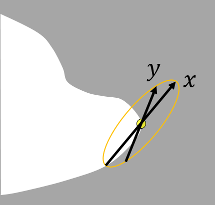

# ここ{#sec:koko}

かいてみるああああああああああああああああああ
ああああああああああああああああああああああああ

## 小さい

小さいの

### もっと小さい

図の番号＝[@fig:image]

 {#fig:image height=0.1\\paperheight}

|      | column1  | column2  | column3  |
| :--- | :------- | :------- | -------- |
| row1 | item 1,1 | item 2,1 | ---      |
| row2 | ---      | item 2,2 | ---      |

Table: 表の例 "An Example of Table." {#tbl:example}

表の番号＝[@tbl:example]

章の番号＝[@sec:koko]節

\noindent
インデントしない

$A/W$

$$
\Delta_l = \sum_{i=l|1}^L\delta_{pi}
$$

キャプションみたいなの[^cap]．

[^cap]: キャプション内容

引用の練習

[@fatfinger]
[@understanding]
[@fastercommand]
[@wristcam]
[@emgsignal]
[@wristflex]
[@tomo]
[@magicring]
[@ubifinger]
[@viband]
[@thumbslide]
[@wristwhirl]
[@tilt]
[@float]
[@tilttechniques]
[@digits]
[@pinchwatch]

# 本番

つくったもの
手首に赤外線カメラつけて，親指トラッキング出来る君
出来るかわからない
やる必要があること
深度画像と親指のポジションの対応性→取れれば勝ち
トラッキング位置と親指の先のポジションとの対応を評価
ThumbSlideみたいな方針

新規性
親指の裏側からトラッキングすることで，手の動きを妨げない

実験
目的一意であることを求める
IR画像と入力面における親指の位置が1対1であることを確かめる

実験セットアップ　ThumbSlide参照
- 手を置く台＝手首固定
- Leap(USB)
- すべり止めシート
- 15mmのグリッドが入った入力面を模した平面のついた棒
- 1点が黒く塗られた親指用の指サック

軌跡画像のせたい
平均の軌跡は図示
各人の平均の軌跡を6つぐらい重ね合わせたもの
完全に平均化した軌跡を載せる

座標変換

# はじめに

あ

# 関連研究

# システム

# 実験

# 考察

# ここからは大進捗の原稿

# はじめに

今日，スマートウォッチは情報に素早くアクセスできるツールとして，広く普及している．
スマートウォッチの操作手法として，多くのデバイスでの採用実績や，
操作の理解が容易であることから，タッチ操作は最も基本的なものである．

しかし，この操作には2つの問題点がある．
1つ目はスワイプなどの連続的な入力を行う場合，装着している手とは別の空いている手が必要な点である．
つまり，ユーザはスマートウォッチを装着している手とは別の手で，画面を操作する必要がある．
そのため，荷物を持っていたり，傘を差していたりといった状況では操作することが困難である．
2つ目は小さなターゲットを指で選択することが困難な点である．
これはFat Finger問題と呼ばれ[@fatfinger]]，要因として指先によってターゲットが見えなくなる（オクルージョン）ことや，
指先の接触面の中心部とユーザの指し示したい点に差があること[@understanding]などが考えられる．
市販の製品では，操作精度を保つために選択可能な項目を拡大し，
操作の多くを連続するスワイプとタップの組み合わせという形で提供している[@fastercommand]．

市販のスマートウォッチを片手のみで操作する手法として音声入力が挙げられるが，
騒音環境下での認識率が悪いことや，公共の場で声を出すことによるプライバシーの問題を抱えている．
また，OSにAndroid Wear[@androidwear]を搭載するデバイスでは手首を返すジェスチャによって，
いくつかの操作を片手のみで行うことが出来る[@wristgesture]．
しかし，ジェスチャはパターンが増えるほど覚えるのが困難になる上，
行うことが出来るのは「ページをめくる」といった操作のショートカットに過ぎない．

本稿では，握りこぶしの人差し指側の側面上で親指を滑らせることによる操作手法ThumbSurfaceを提案する（図[@fig:image]）．
これにより，ユーザは片手のみを用いたスマートウォッチへの2次元方向の入力が可能になる．
また，タッチパネルを指で触れることなく入力を行うため，Fat Finger問題を解消することができる．
実装には赤外線カメラを用い，手首の親指側に固定した上で，握りこぶし側面上で親指を滑らせた時の第2関節の位置の変化をトラッキングする．
提案システムは親指のみを動かして操作するため，画面は静止したままである．
また，カメラは手の甲側から親指の位置をトラッキングするため，手の内側の変化をカメラで検出する手法に比べ，
他の指によってカメラから親指が隠されるといった心配はない．

 {#fig:image0}

# 関連研究

提案手法は，握りこぶしの側面上で親指を滑らせることによって片手での2次元方向の入力を可能にする．
本章では，同様に片手のみを用いて入力する操作手法について述べる．なお，表 1は各手法を特徴毎に分類したものである．

## 片手での非連続的操作

センサによって手のジェスチャを認識し，操作のショートカットとして機能するような不連続的な操作を行う研究には\[4-10]などがある．Vardyらの研究\[4]では手首の下に固定したカメラを用いて，Hasanらの研究\[5]では筋電位センサを用いて，手の静的ジェスチャを認識する．WristFlex\[6]は感圧センサのアレイを，Tomo\[7]は電気インピーダンストモグラフィセンサのアレイを手首に巻くことにより，手の静的ジェスチャを認識する．Magic Ring\[8]は指輪型デバイスに内蔵された加速度センサによって，Ubi-Finger\[9]は様々なセンサが搭載されたグローブを用いることで手の動的ジェスチャを認識する．Viband\[10]は一般的なスマートウォッチに搭載されている加速度センサのクロック周波数を上げることで，手の動的なジェスチャ認識やデータの受信を可能にする．

市販されている製品には，腕に巻き付けた筋電位センサのアレイで手の動的ジェスチャを認識するMyo\[ ]や手首に装着した生体音響信号センサで手の動的ジェスチャを認識するClip\[ ]などがある．提案手法では握りこぶしの側面上で親指を滑らせることによって，連続的な操作を行うという点でこれらの研究と異なる．

## 片手での連続的操作

センサによって手のジェスチャを認識し，スワイプなどの連続的な操作を行う研究には\[11-14, 16]などがある．
ThumbSlide\[11]はフォトリフレクタアレイを手首に巻き付け，
装着した手の親指が人差し指の側面でスライドした量をセンシングすることで，1次元方向の入力を可能にする．
本研究では，2次元方向の入力を行う．
WristWhirl\[12]は手首に赤外線近接センサのアレイを巻くことで，
手をジョイスティックのように傾けることによる2次元方向の入力を可能にする．
しかし，手首の自由度は少なく，ユーザが意図した方向に手首を傾けるのは難しいといった問題があった．

Guoらの研究\[13]では，スマートウォッチに内蔵されている加速度センサを用いて，
装着している腕を傾けることでのメニュー選択や連続的入力を可能にする．同じく内臓の加速度センサを用いて，傾きでのカーソル操作を行うFloat\[14]は，複数のセンサを組み合わせることによって，精度の高い空中でのタップ動作の検出を可能にする．これらの加速度センサを用いた操作では，画面が傾いたり移動したりといったことがたびたび起こるため，画面上のカーソルを操作するといったことに適していない\[15]．

Digits\[16]は手首の下につけた赤外線カメラを，PinchWatch\[17]は胸部などに固定した深度カメラを用いてハンドジェスチャを認識し，アイズフリーな入力を可能にする．しかし，これらは指の位置によって，カメラから他の指を隠してしまう可能性がある．

|           | 非連続的入力            | 連続的入力          |
| :-------- | :--------------------- | :----------------- |
| 画面が動く | 手首を返すジェスチャ\[b] | 腕を傾ける\[13, 14] |
| 画面が静止 | 静的ジェスチャ\[4-7] \n 動的ジェスチャ\[8-10, c, d] | 親指を人差し指の横でスライド\[11] \n 手首を傾ける\[12] \n 手首下に赤外線カメラを設置\[16] \n 身体に深度カメラを設置\[17] |

Table: テーブルテスト "Table." {#tbl:table0}

Myo gesture control armband.
https://www.myo.com/. (Accessed on 07/08/2017).

Flicktek - gesture control.
http://www.flicktek.com/clip.html. (Accessed on 07/08/2017).

# システム

ThumbSurfaceは，握りこぶしの人差し指側の側面上のどの位置を親指が触れているかを推定し，
その移動量を用いてスマートウォッチに対し，連続的な2次元方向の入力を行う手法である．
本章では実装及び位置推定アルゴリズムについて述べる．

## 設計方針

システムの設計にあたって，以下の3つを方針とした．

- 画面が静止していること
- 小さな動きで操作できること
- 通常の操作を妨げないこと

## 実装

握りこぶし側面上での親指の位置を推定するにあたり，
提案手法では手の甲の側から親指の第2関節をトラッキングする．
親指の正確な検出を行うために赤外線カメラを手首に固定したプロトタイプを作成した（図\[fig]）．
なお，赤外線カメラとして，今回はLeap Motion\[ ]を使用した．
Leap Motionはデータ通信と電源供給の都合上，PCにUSB接続されている．

LeapMotionのリンク
Leap Motion. https://www.leapmotion.com/. (Accessed on 07/08/2017).

 {#fig:image02}

## 親指の位置推定アルゴリズム

握りこぶしの側面上で親指を滑らせる際，親指全体が大きく動くことがわかる．また，握りこぶしの側面に軽く触れていれば，タッチ位置と親指全体の形状は1対1対応となる．手首にカメラを固定した場合，親指の特に第2関節部分が凸形状となっていることがわかる（図 3上）．よって，この第2関節の位置を検出するプログラムをProcessing v3.3.3を用いて作成した．

 {#fig:image03}

### 親指を検知するために2値化

親指の大まかな識別のため，赤外線カメラから得られた画像のうち，個々のピクセルデータから得られたHSB値，特にBの値を利用する．画像中の全ピクセル含めたBの最大値Bmaxと最小値Bminを元に，2値化する閾値tを
((Bmax+Bmin))/2
と定義する．閾値tが求まったら，全ピクセルに対して閾値よりも高いB値であった場合は白く塗りつぶし，それ以外の場合は黒く塗りつぶす．

### ノイズ除去

2値化を行った後も，しばしば赤外線の反射などが原因で，小さな白い領域が残ってしまう場合がある．その場合は，赤外線カメラが手首に密着していることを利用し，手首付近である左側から連続している白い領域のみを抽出する．これにより，親指以外に白く残ってしまった領域を除去することが出来る．

### 第2関節の検出

最後に第2関節の検出を行う．既に親指が白い部分として検出できているため，図 3下中で最も右端の白いピクセルの座標を求める．これによって，第2関節の位置を取得する．

# 予備動作テスト

図 2のプロトタイプを用いて，参加者を筆者一人として，予備動作テストを行った．行うタスクとしては，握りこぶしの側面（人差し指の側面）を出ないように出来る限り大きな円を10回描いた．目的は以下の2点を確認するためである．

- 親指が検出可能であるか．
- タッチしている位置と親指の第2関節が1対1対応になっているか．

実際の動作の軌跡は図４のような楕円になった．

図 4　カメラから見た第2関節の軌跡

 {#fig:image04}

親指が円を描いたとき，第2関節も楕円ではあるが，円を描いた．よって，システムは親指を認識することができ，親指のタッチ位置と第2関節の位置は1対1対応していることがわかった．

# 今後の展望

今回は筆者1人を対象に予備動作テストという形で操作が可能であるかの検討を行ったが，手のサイズが異なる複数名を対象に大まかな位置をポインティングできるかの実験を行う予定である．

また，赤外線カメラの画像から親指の位置推定アルゴリズムをブラッシュアップすることを考えている．具体的には2値化の閾値において分散などを考慮して決定することや，ノイズ除去にラベリングを用いることを検討している．

現段階でのプロトタイプには，親指トラッキングのために赤外線カメラとしてLeap Motionを用いた．しかし，ウェアラブルな操作環境を提供するためには，環境光によって赤外線カメラが誤作動する可能性を考慮する必要がある．今後はTOF方式の深度カメラを用いることを考えている．また，小さなデバイスを作成することによって，カメラ自身の大きさにより生じる揺れを軽減することが期待出来る．

決定動作に関しては，現在検討中である．１つの案として，握りこぶしの側面上で親指を素早く押し込む動作を検出することを考えている．

