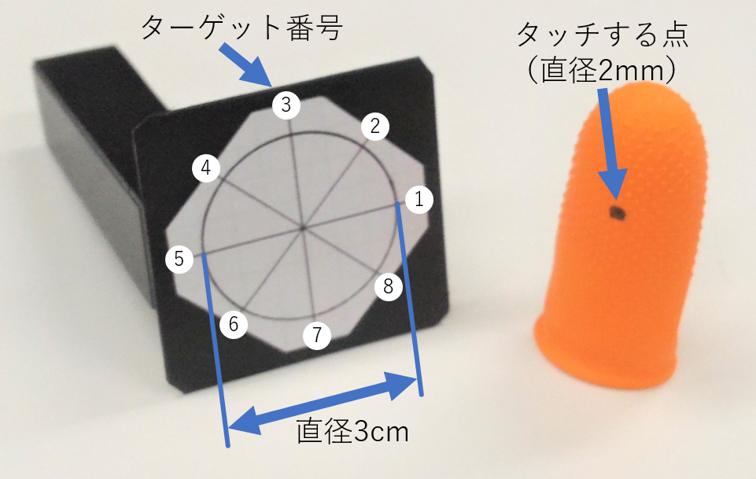

# はじめに

今日，スマートウォッチは情報に素早くアクセスできるツールとして，広く普及している．
スマートウォッチの操作手法として，多くのデバイスでの採用されている点や，
操作の理解が容易であるという点で，タッチ操作は最も基本的なものである．

しかし，この操作には2つの問題点がある．
1つ目はスワイプなどの連続的な入力を行う場合，装着している手とは別の空いている手が必要な点である．
つまり，ユーザはスマートウォッチを装着している手とは別の手で，画面を操作する必要がある．
そのため，荷物を持っていたり，傘を差していたりといった状況では操作することが困難である．
2つ目は小さなターゲットを指で選択することが困難な点である．
これはFat Finger問題と呼ばれ[@fatfinger]，要因として指先によってターゲットが見えなくなること（オクルージョン）や，
指先の接触面の中心部とユーザの指し示したい点に差があること[@understanding]などが考えられる．
市販の製品では，操作精度を保つために選択可能な項目を拡大し，
操作の多くを連続するスワイプとタップの組み合わせという形で提供している[@fastercommand]．

これを解消する方法として，
市販のスマートウォッチを片手のみで操作する手法として音声入力が挙げられるが，
騒音環境下での認識率が悪いことや，公共の場で声を出すことによるプライバシーの問題を抱えている．

本稿では，握りこぶしの人差し指側の側面上で親指を滑らせることによる操作手法ThumbSurfaceを提案する（図[@fig:image]）．
これにより，ユーザは片手のみを用いたスマートウォッチへの2次元方向の入力が可能になる．
また，タッチパネルを指で触れることなく入力を行うため，Fat Finger問題を解消することができる．
実装には赤外線カメラを用い，手首の親指側に固定した上で，握りこぶし側面上で親指を滑らせた時の第2関節の位置の変化をトラッキングする．
提案システムは親指のみを動かして操作するため，画面は静止したままである．
また，カメラは手の甲側から親指の位置をトラッキングするため，手の内側の変化をカメラで検出する手法に比べ，
他の指によってカメラから親指が隠されるといった心配はない．
さらに，音声入力やタッチ操作といった他の操作との併用も可能である．

 {#fig:image}

# 関連研究

提案手法は，握りこぶしの側面上で親指を滑らせることによって片手での2次元方向の入力を可能にする．
本章では，同様に片手のみを用いて入力する操作手法について述べる．
なお，表[@tbl:table]は各手法を特徴毎に分類したものである．

# 片手での不連続的操作

センサによって手のジェスチャを認識し，操作のショートカットとして機能するような操作を行う研究には以下のようなものがある．
Vardyらの研究[@wristcam]では手首の下に固定したカメラを用いて，
手の静的ジェスチャを認識する．
WristFlex[@wristflex]は感圧センサのアレイを，
Tomo[@tomo]は電気インピーダンストモグラフィセンサのアレイを手首に巻くことにより，手の静的ジェスチャを認識する．
Magic Ring[@magicring]は指輪型デバイスに内蔵された加速度センサによって，
Ubi-Finger[@ubifinger]は様々なセンサが搭載されたグローブを用いることで手の動的ジェスチャを認識する．
Viband[@viband]は一般的なスマートウォッチに搭載されている加速度センサのクロック周波数を上げることで，
手の動的なジェスチャ認識やデータの受信を可能にする．

市販されている製品には，腕に巻き付けた筋電位センサのアレイで手の動的ジェスチャを認識するMyo[@myo]や，
手首に装着した生体音響信号センサで手の動的ジェスチャを認識するClip[@clip]などがある．

# 片手での連続的操作

センサによって手のジェスチャを認識し，スワイプなどの連続的な操作を行う研究には以下のようなものがある．
ThumbSlide[@thumbslide]はフォトリフレクタアレイを手首に巻き付け，
装着した手の親指が人差し指の側面でスライドした量をセンシングすることで，1次元方向の入力を可能にする．
WristWhirl[@wristwhirl]は手首に赤外線近接センサのアレイを巻くことで，
手をジョイスティックのように傾けることによる2次元方向の入力を可能にする．

Guoらの研究[@tilt]では，スマートウォッチに内蔵されている加速度センサを用いて，
装着している腕を傾けることでのメニュー選択や連続的入力を可能にする．
同じく内臓の加速度センサを用いて，傾きでのカーソル操作を行うFloat[@float]は，
複数のセンサを組み合わせることによって，精度の高い空中でのタップ動作の検出を可能にする．

Digits[@digits]は手首の下につけた赤外線カメラを，
PinchWatch[@pinchwatch]は胸部などに固定した深度カメラを用いてハンドジェスチャを認識し，
アイズフリーな入力を可能にする．

|           | 非連続的入力            | 連続的入力          |
| :-------- | :--------------------- | :----------------- |
| 画面が動く | 手首を返すジェスチャ | 腕を傾ける |
| 画面が静止 | 静的ジェスチャ \n 動的ジェスチャ | 親指を人差し指の横でスライド \n 手首を傾ける \n 手首下に赤外線カメラを設置 \n 身体に深度カメラを設置|

Table: 片手でのスマートウォッチ操作手法の分類 {#tbl:table}

# ThumbSurface{#sec:system}

ThumbSurfaceは，握りこぶしの人差し指側の側面上のどの位置を親指が触れているかを推定し，
その移動量を用いてスマートウォッチに対し，2次元方向の入力を行う手法である．
本章では実装及び親指の位置推定アルゴリズムについて述べる．

## 設計方針

システムの設計にあたって，以下の3つを方針とした．

- 画面が静止していること
- 小さな動きで操作できること
- 通常の操作を妨げないこと

## 実装

握りこぶし側面上での親指の位置を推定するにあたり，
提案手法では手の甲の側から親指の第2関節をトラッキングする．
親指の正確な検出を行うために赤外線カメラを手首に固定したプロトタイプを作成した（図[@fig:setup]）．
なお，赤外線カメラとして，今回はLeap Motion[@leapmotion]を使用した．
Leap Motionはデータ通信と電源供給の都合上，PCにUSB接続されている．

 {#fig:setup}

## 親指の位置推定アルゴリズム

握りこぶしの側面上で親指を滑らせる際，親指全体が大きく動く．
また，握りこぶしの側面に軽く触れていれば，タッチ位置と親指全体の形状は連動して変化する．
手首にカメラを固定した場合，親指の特に第2関節部分が凸形状となっていることがわかる（図[@fig:ir]上）．
この第2関節の位置を検出するプログラムをProcessing v3.3.3を用いて作成した．

 {#fig:ir}

### 親指を検知するために2値化

親指の大まかな識別のため，赤外線カメラから得られた画像のうち，
個々のピクセルデータから得られたHSB値，特にBの値を利用する．
画像中の全ピクセル含めたBの最大値$Bmax$と最小値$Bmin$を元に，2値化する閾値$t$を
(Bmax+Bmin)/2
と定義する．
閾値$t$が求まったら，全ピクセルに対して閾値よりも高いB値であった場合は白く塗りつぶし，
それ以外の場合は黒く塗りつぶす．

### ノイズ除去

2値化を行った後も，しばしば赤外線の反射などが原因で，小さな白い領域が残ってしまう場合がある．
その場合は，赤外線カメラが手首に密着していることを利用し，
手首付近である左側から連続している白い領域のみを抽出する．
これにより，親指以外に白く残ってしまった領域を除去することが出来る．

### 第2関節の検出

最後に第2関節の検出を行う．既に親指が白い部分として検出できているため，
図[@fig:ir]下中で最も右端の白いピクセルの座標を求める．
これによって，第2関節の位置を取得する．

# 予備実験

著者を含めた研究室内の大学生及び大学院生を4名を参加者として，予備実験を行った．
なお，参加者は男性4名で，年齢が23‐25歳，3名が右利きであり，左利きは1名であった．
また，親指の第2関節から先まで長さは6.0-6.7cmだった．
実験の目的は，親指移動時の赤外線画像から取得した第2関節の位置を観察し，
親指が触れている位置によって変化することを確認することである．
本章では，この実験の内容及び結果，その考察を述べる．

## 実験環境

実験には，腕の位置や角度，他の指の曲げ状態が影響しないようにするため，
[@sec:system]章で述べたプロトタイプではなく，台座にLeap Motionを固定したものを使用した（図[@fig:pilot]）．
参加者に親指の位置を指示するにあたって，図[@fig:target]のような入力面を模したデバイスと，
タッチする点（以下，カーソルと呼ぶ）が描かれた親指につける指サックを用いた．
入力面には，直径3cmの円と中心から8つの方向に伸びる直線が描かれており，
この8つの交点をターゲットとする．
ターゲット番号は親指から最も遠い交点を始点として，反時計回りに1, 2, 3, .., 8番とする．
なお，参加者は全員，左手の親指でカーソル操作を行い，事前に親指以外の指を動かさないように指示した．
実験システムの実装はProcessing v3.3.3を用いて行った．

 {#fig:pilot}

 {#fig:target}

## 実験タスク

はじめに，参加者は入力面デバイスに描かれた円の中心に親指のカーソルをあわせ，
左手でキーボードのエンターキーを押すことで，その時のカメラで捉えた第2関節の座標を記録し，操作の中心点とする．
次に，ランダムに指定された番号のターゲットを，親指の上のカーソルでタッチし，同じくエンターキーで座標を記録する．
参加者はこれらを繰り返し，各ターゲットを5回ずつ指し示した．
総データ数は，参加者$4$名$\times$ターゲット数$8\times$各$5$回$=160回分$である．

# 結果及び考察

図[@fig:graphs]は，赤外線カメラから取得した親指の位置座標である．
著者や参加者A，参加者Bのグラフを見ると，おおよそターゲット数と同じ8つのグループに分かれていることがわかる．
このことより，第2関節の位置と入力面における親指のタッチの位置が対応していることが伺える．
著者の点がより纏まりをもって見えるのは，システムの処理内容を熟知していたためであると考えられる．

また，参加者Cは他の参加者に比べて，点の座標が分散している．
これは，事前に事前に親指以外の指を動かさないように指示したにも関わらず，
日頃の癖から，他の4本の指で入力面デバイスを動かしてしまったためであると推測される．
この点に関してはユーザ自身が注意して操作する必要がある．

 {#fig:graphs height=\\paperheight}

# 今後の展望

赤外線カメラの画像から親指の位置推定アルゴリズムをブラッシュアップすることを考えている．
具体的には2値化の閾値において分散などを考慮して決定することや，ノイズ除去にラベリングを用いることを検討している．

現段階でのプロトタイプには，親指トラッキングのために赤外線カメラとしてLeap Motionを用いた．
しかし，ウェアラブルな操作環境を提供するためには，環境光によって赤外線カメラが誤作動する可能性を考慮する必要がある．
今後は腕に装着可能なTOF方式の深度カメラを用いることを考えている．
また，小さなデバイスを作成することによって，カメラ自身の大きさにより生じる揺れを軽減することが期待出来る．
決定動作に関しては，現在検討中である．１つの案として，握りこぶしの側面上で親指を素早く押し込む動作を検出することを考えている．